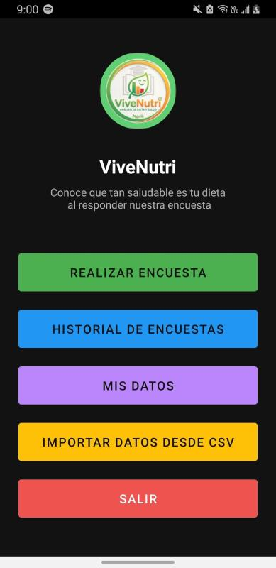
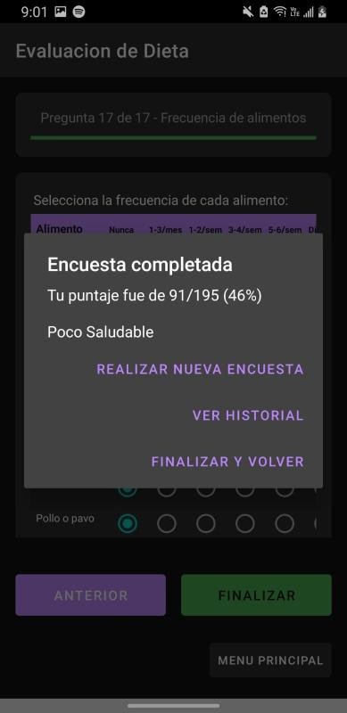
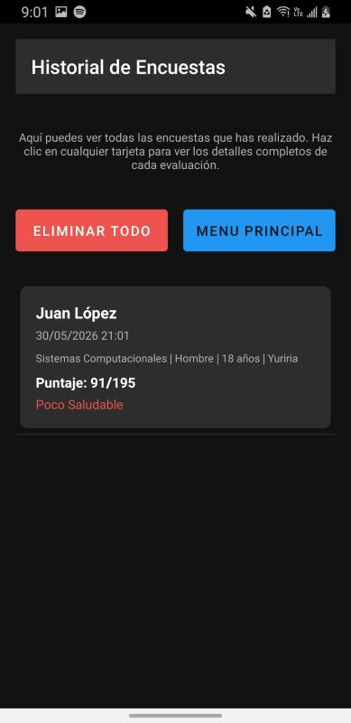
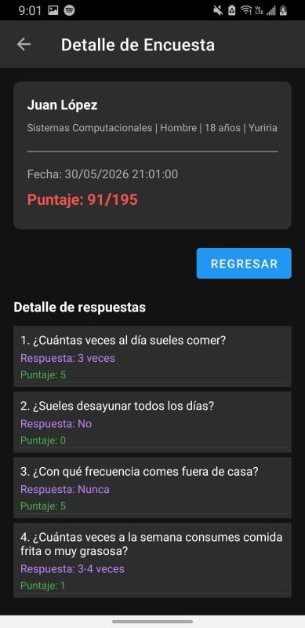

# ViveNutri

Aplicación móvil desarrollada en **Java para Android** que permite evaluar la calidad de los hábitos alimenticios de un usuario mediante un cuestionario estructurado (IAS, FFQ). Incluye almacenamiento local de evaluaciones, historial de resultados e importación de datos desde archivos CSV.

**Proyecto desarrollado para facilitar la evaluación de hábitos alimenticios y promover el seguimiento personal de la alimentación mediante una aplicación móvil sencilla e intuitiva.**

<p align="center">
  
</p>

## Problema

La evaluación de hábitos alimenticios suele realizarse mediante formularios o cuestionarios cuyos resultados pueden ser difíciles de interpretar y almacenar para un seguimiento posterior.

ViveNutri automatiza este proceso calculando una puntuación basada en las respuestas del usuario, clasificando la calidad de su alimentación y permitiendo conservar un historial de evaluaciones directamente en el dispositivo.

## Características principales

- Evaluación de hábitos alimenticios mediante un cuestionario estructurado.
- Más de 30 preguntas relacionadas con hábitos generales y frecuencia de consumo de alimentos.
- Cálculo automático de una puntuación nutricional.
- Clasificación de resultados en distintas categorías según el puntaje obtenido.
- Registro del perfil del usuario.
- Almacenamiento local del historial de evaluaciones.
- Consulta del detalle de evaluaciones anteriores.
- Importación de información desde archivos CSV.
- Procesamiento y normalización de datos importados.
- Funcionamiento completamente local, sin necesidad de conexión a internet.

## Tecnologías

- Java
- Android Studio
- XML
- SharedPreferences
- Gson

## Arquitectura

- Aplicación Android basada en Activities.
- Persistencia local mediante SharedPreferences y serialización con Gson.
- Interfaz desarrollada utilizando XML.
- Procesamiento de archivos CSV mediante InputStream y BufferedReader.

## Características técnicas destacadas

- Importación de datos desde archivos CSV con soporte para diferentes codificaciones de caracteres.
- Normalización automática de texto para garantizar compatibilidad con las respuestas del cuestionario.
- Serialización y almacenamiento de objetos complejos utilizando Gson.
- Generación dinámica de componentes de interfaz para responder cuestionarios.
- Sistema de puntuación diferenciado según el tipo de alimento evaluado.
- Persistencia de datos sin utilizar bases de datos externas.

## Requisitos previos

- Android Studio.
- JDK compatible con el proyecto.
- Dispositivo Android o emulador.
- SDK de Android instalado.

## Instalación y configuración

Clonar el repositorio:

```bash
git clone https://github.com/juanla7979/ViveNutri.git
cd ViveNutri
```

Abrir el proyecto desde Android Studio.

Sincronizar las dependencias de Gradle.

Compilar y ejecutar la aplicación en un dispositivo físico o emulador Android.

## Capturas

| Encuesta | Historial | Historial Detallado |
|----------|----------|----------|
|  |  |  |

